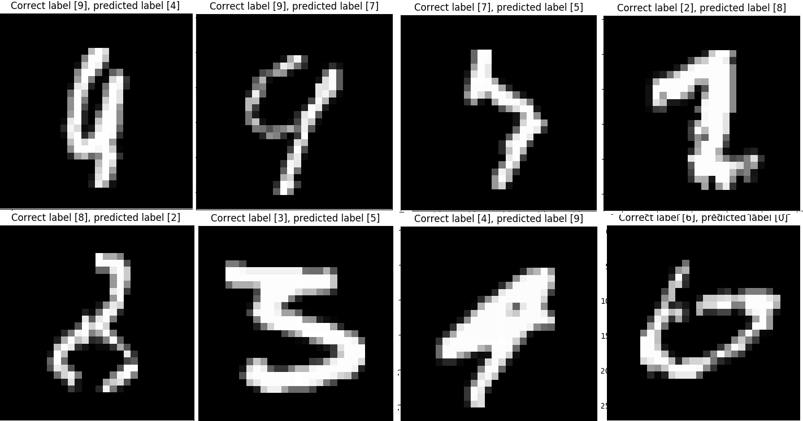

# SVM for MNIST dataset
> Simple python implementation with sklearn library for MNIST dataset, which achive more than 98% accuracy 🎉🎉🎉🎉🎉

## Fast validation
Use PCA to reduce input dimension from 784 to 154 but presever 95% information

Use only a subset of input set to validate to make validation process even faster (10_000 samples)

## Preprocess
Deskew method as preprocess method when we train the finally model for better accuracy

## Final hypothesis
After using 10_000 samples for validation, we combine it to 50_000 training samples to to train the final hypothesis. Make the best result possible


## Install dependencies with pip
```bash
pip install -r requirements.txt
```

## Usage
```bash
python main.py
```

## Note
This repository is quite heavy because we include mnist dataset file

The unittest haven't been written yet 😅😅

## Images
Start training


Final result


Deskew effect


Some missclassify samples



## References
[mnist_homepage](http://yann.lecun.com/exdb/mnist/)

[deskew](https://fsix.github.io/mnist/Deskewing.html)

[PCA](https://towardsdatascience.com/pca-using-python-scikit-learn-e653f8989e60)

[sklearn](https://scikit-learn.org/stable/)

## Authors
1612088@student.hcmus.edu.vn

1512587@student.hcmus.edu.vn

## License ©
[MIT](https://choosealicense.com/licenses/mit/)
